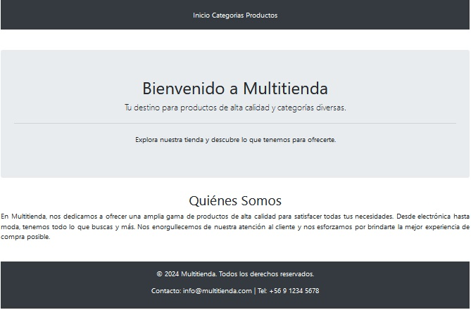
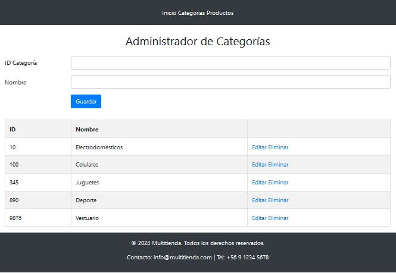
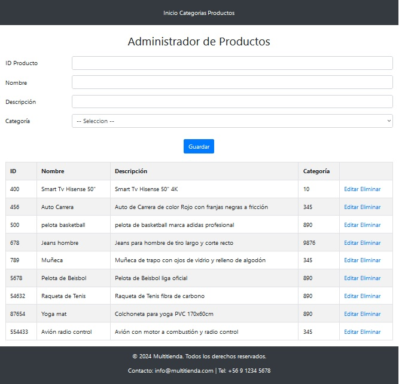

# Multitienda Web Application

## Descripción
Multitienda es una aplicación web desarrollada en ASP.NET que permite la gestión de múltiples tiendas, incluyendo la administración de categorías y de productos. La aplicación utiliza Bootstrap para un diseño responsive y seguro, además de Entity Framework para la interacción con la base de datos.

## Características
- **Gestión de Productos:** Administración de productos, incluyendo la capacidad de añadir, editar y eliminar productos vinculados a categorías.
- **Gestión de Categorías:** Permite administrar eficientemente las categorías de productos.
- **Diseño Responsive:** Uso de Bootstrap para asegurar que la aplicación sea accesible en todos los dispositivos.

## Tecnologías Utilizadas
- **ASP.NET (C#)**
- **Entity Framework 4.8**
- **Bootstrap**
- **SQL Server**
- **LINQ**

## Capturas de Pantalla

### 1. Inicio

### 2. Gestión de Categorías

### 3. Gestión de Productos

